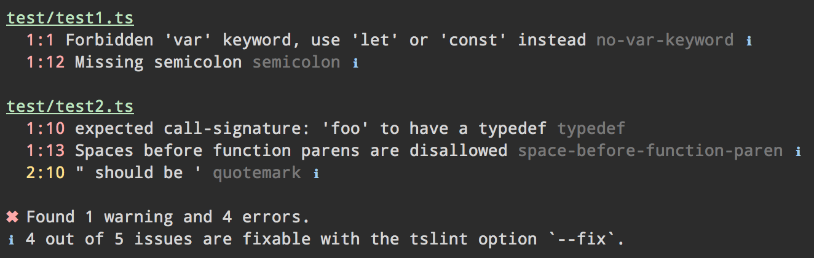

Custom TSLint Formatters
========================

A collection of custom TSLint formatters. With colors.

Included Formatters
-------------------

### `grouped`

Prints a block for each file with the file name as headline.



### `vscode`

This is a technical formatter that can be used as input for a task in Visual Studio Code to lint all files in a project.


#### Usage

First add a new npm task to your `package.json`:

```json
{
  "lint:vscode": "tslint -s node_modules/custom-tslint-formatters/formatters -t vscode 'src/**/*.+(ts|tsx)'"
}
```

Then add a new task to `.vscode/tasks.json`:

```json
{
  "version": "0.1.0",
  "command": "npm",
  "isShellCommand": true,
  "showOutput": "always",
  "suppressTaskName": true,
  "tasks": [
    {
      "taskName": "lint",
      "args": ["run", "lint:vscode"],
      "problemMatcher": {
        "owner": "tslint",
        "fileLocation": ["relative", "${workspaceRoot}"],
        "severity": "warning",
        "pattern": {
          "regexp": "^\\[tslint\\] (.*):(\\d+):(\\d+):\\s+(.*)$",
          "file": 1,
          "line": 2,
          "column": 3,
          "message": 4
        }
      },
      "showOutput": "never"
    }
  ]
}
```

Installation
------------

```
npm install custom-tslint-formatters --save-dev
```

Usage
-----

On the commandline specify the formatters directory with `-s` and the formatter with `-t` (see list of formatters above):
```
tslint -s node_modules/custom-tslint-formatters/formatters -t grouped src/**/*.ts
```

For [tslint-loader][] add a `tslint` configuration block to your webpack config specifying the `formattersDirectory` as well as the `formatter` (see list of formatters above):
```javascript
module.exports = {
  module: {
    preLoaders: [
      {
        test: /\.ts$/,
        loader: "tslint"
      }
    ]
  },
  tslint: {
    formattersDirectory: 'node_modules/custom-tslint-formatters/formatters',
    formatter: 'grouped'
  }
}
```

[tslint-loader]: https://github.com/wbuchwalter/tslint-loader
